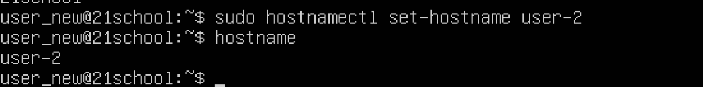
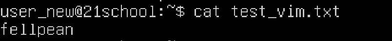
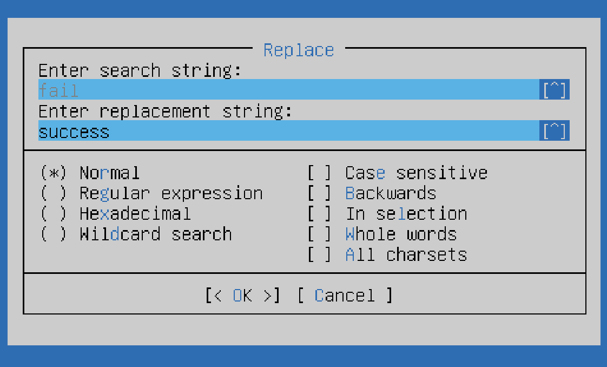
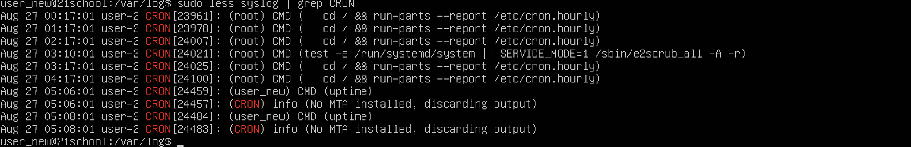
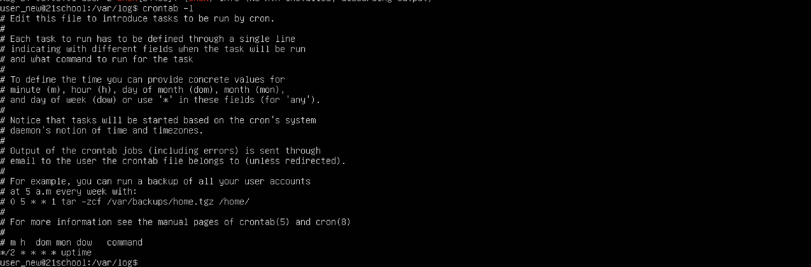

## Part 1. Установка ОС
#### :white_circle: Задание :white_circle:

Установить Ubuntu 20.04 Server LTS без графического интерфейса. (Используем программу для виртуализации - UTM)
Графический интерфейс должен отсутствовать.

Узнайте версию Ubuntu, выполнив команду
cat /etc/issue.

Вставьте скриншот с выводом команды.

#### :speech_balloon: Решение :speech_balloon:

1. Была установленна программа UTM, Ubuntu 20.04.2 Server LTS без графического интерфейса.

2. Результат выполнения команды cat /etc/issue.

## Part 2. Создание пользователя
#### :white_circle: Задание :white_circle:

Создай пользователя, отличного от созданного при установке. Пользователь должен быть добавлен в группу adm.

Вставь скриншот вызова команды для создания пользователя.
Новый пользователь должен быть в выводе команды 
cat /etc/passwd

Вставь скриншот с выводом команды.

#### :speech_balloon: Решение :speech_balloon:

1. Создаем пользователя, отличного от созданного при установке через sudo adduser.

2. Добавляем юзера в группу adm с помощью sudo usermod -a -G и проверяем.

3. Результат выполнения cat /etc/passwd:

## Part 3. Настройка сети ОС
#### :white_circle: Задание :white_circle:

Задай название машины вида user-1.
Установи временную зону, соответствующую твоему текущему местоположению.
Выведи названия сетевых интерфейсов с помощью консольной команды.
В отчёте дай объяснение наличию интерфейса lo.
Используя консольную команду, получи ip адрес устройства, на котором ты работаешь, от DHCP сервера.
В отчёте дай расшифровку DHCP.
Определи и выведи на экран внешний ip-адрес шлюза (ip) и внутренний IP-адрес шлюза, он же ip-адрес по умолчанию (gw).
Задай статичные (заданные вручную, а не полученные от DHCP сервера) настройки ip, gw, dns (используй публичный DNS серверы, например 1.1.1.1 или 8.8.8.8).
Перезагрузи виртуальную машину. Убедись, что статичные сетевые настройки (ip, gw, dns) соответствуют заданным в предыдущем пункте.
В отчёте опиши, что сделал для выполнения всех семи пунктов (можно как текстом, так и скриншотами).
Успешно пропингуй удаленные хосты 1.1.1.1 и ya.ru и вставь в отчёт скрин с выводом команды. В выводе команды должна быть фраза «0% packet loss».

#### :speech_balloon: Решение :speech_balloon:

1. Переименуем виртуальную машину в user-1 с помощью sudo hostname и проверим на успешное выполнение: 

2. Проверим исходное время через date, изменим на актуальную версию через sudo timedatectl.

3. Проверим получившееся время с учетом региона.

4. Далее введены названия сетевых интерфейсов с помощью консольной команды – ip l, ip address, ls /sys/class/net. 

> lo (loopback device) – виртуальный интерфейс, присутствующий по умолчанию в любом Linux. Он используется для отладки сетевых программ и запуска серверных приложений на локальной машине. С этим интерфейсом всегда связан адрес 127.0.0.1. У него есть dns-имя – localhost. Интерфейс lo является локальной петлёй. Она предназначена для обеспечения сетевого доступа к компьютеру.

5. С помощью консольной команды ip r получен ip устройства от DHCP сервера. 

> Протокол динамической конфигурации хоста (Dynamic Host Configuration Protocol) - это сетевой протокол, который позволяет устройствам в локальной сети автоматически получать IP-адрес, подсеть, шлюз по умолчанию и другие параметры, необходимые для подключения к сети. DHCP облегчает управление адресами в сети и предотвращает конфликты IP-адресов.

6. Чтобы определить и вывести на экран внешний ip-адрес шлюза (ip) было использовано curl ifconfig.co.

7. Чтобы определить внутренний IP-адрес шлюза, он же ip-адрес по умолчанию (gw) использовано ip route/route -n.

8. Далее вручную задавались статические настройки ip, gw, dns, используя публичные DNS серверы, например 1.1.1.1 или 8.8.8.8. DHCP автоматически присваивает устройству IP, поэтому сначала необходимо отключить облачную инициализацию. Проверяем, что она отключена:

9. Открываем  файл конфигурации netplan в текстовом редакторе vim через пользователя root, необходимо изменить стандартный шаблон:

10. Задаем статические настройки: изменен параметр dhcp4 на значение false, в addresses указан статический IP-адрес: 192.166.64.2/24, и в gateway4 зададим внутренний IP-адрес 192.166.64.1 В параметре addresses раздела nameservers указаныы публичные серверы (1.1.1.1 или 8.8.8.8).

11. После перезагрузки ВМ данные корректны, проверены через cat /etc/netplan/00-installer-config.yaml.

12. Пропингованы удаленные хосты 1.1.1.1 и ya.ru. Фраза «0% packet loss» означает, что все отправленные пакеты данных успешно достигли целевого хоста и получили ответ.

## Part 4. Обновление ОС
#### :white_circle: Задание :white_circle:

Обнови системные пакеты до последней на момент выполнения задания версии.

После обновления системных пакетов, если ввести команду обновления повторно, должно появиться сообщение, что обновления отсутствуют;
Вставь скриншот с этим сообщением в отчёт.

#### :speech_balloon: Решение :speech_balloon:

1. Производим обновление системных пакетов.

2. При повторном вводе команды обновления появляется сообщение, что обновления отсутствуют.

## Part 5. Использование команды **sudo**
#### :white_circle: Задание :white_circle:

Разреши пользователю, созданному в Part 2,выполнять команду sudo.

В отчёте объясни истинное назначение команды sudo (про то, что это слово - «волшебное», писать не стоит);
Поменяй hostname ОС от имени пользователя, созданного в пункте Part 2 (используя sudo);
Вставь скрин с изменённым hostname в отчёт.

#### :speech_balloon: Решение :speech_balloon:

1. Создаем пользователя new_user и выдаем ему права sudo. Через groups проверяем, успешно ли пользователь добавлен в группу, владющей sudo.

> Sudo (Substitute user and do - подменить пользователя и выполнить) – это утилита для операционных систем семейства Linux, позволяющая пользователю запускать программы с привилегиями другой учётной записи, как правило, суперпользователя.

2. Далее переключаемся на созданного пользователя user_new и под его аккаунтом изменяем имя хоста на user-2.

## Part 6. Установка и настройка службы времени
#### :white_circle: Задание :white_circle:
Настрой службу автоматической синхронизации времени.
Выведи время часового пояса, в котором ты сейчас находишься.
Вывод следующей команды должен содержать NTPSynchronized=yes: 
timedatectl show
Вставь скрины с корректным временем и выводом команды в отчёт.

#### :speech_balloon: Решение :speech_balloon:

1. Сначала убедимся, что синхронизация времени работает через timedatectl status. Проверяем существующий timedatectl (время часового пояса, в котором мы находимся), команда timedatectl show(системные настройки времени и даты в формате "ключ=значение") содержит NTPSynchronized=yes, что означает, что синхронизировано системное время с NTP-сервером.

## Part 7. Установка и использование текстовых редакторов 
#### :white_circle: Задание :white_circle:

Установи текстовые редакторы VIM (+ любые два по желанию NANO, MCEDIT, JOE и т.д.)
Используя каждый из трех выбранных редакторов, создай файл test_X.txt, где X -- название редактора, в котором создан файл. Напиши в нём свой никнейм, закрой файл с сохранением изменений.

В отчёт вставь скриншоты:

Из каждого редактора с содержимым файла перед закрытием;
В отчёте укажи, что сделал для выхода с сохранением изменений.
Используя каждый из трех выбранных редакторов, открой файл на редактирование, отредактируй файл, заменив никнейм на строку «21 School 21», закрой файл без сохранения изменений.

Из каждого редактора с содержимым файла после редактирования;
В отчёте укажи, что сделал для выхода без сохранения изменений.
Используя каждый из трех выбранных редакторов, отредактируй файл ещё раз (по аналогии с предыдущим пунктом), а затем освой функции поиска по содержимому файла (слово) и замены слова на любое другое.

Из каждого редактора с результатами поиска слова;
Из каждого редактора с командами, введёнными для замены слова на другое.

#### :speech_balloon: Решение :speech_balloon:

1. Устанавливаем текстовые редакторы vim/nano/mcedit через sudo apt install.

2. Cоздаем файл test_vim.txt через touch, открываем его в редакторе vim, входим в режим редактиования (insert) и пишем никнейм fellpean, для сохранения изменений использовано сочетание клавиш esc + :wq!.

3. Проверяем содержимое через утилиту cat.

4. Cоздаем файл test_nano.txt через touch, открываем его в редакторе nano, пишем никнейм fellpean, для сохранения изменений использовано сочетание клавиш Ctrl+O, nano предложил принять или изменить имя файла. Принимаем существующее имя файла, нажав Enter. Закрываем файл сочетанием клавиш Ctrl+X.

5. Проверяем содержимое через утилиту cat.

6. Cоздаем файл test_mcedit.txt через touch, открываем его в редакторе mcedit, пишем никнейм fellpean. Закрываем файл и сохраняем изменения.

7. Проверяем содержимое через утилиту cat.

8. Открываем файл test_vim.txt для редактирования, входим в режим редактиования (insert) и пробуем переписать запись на "test test and fail", далее для сохранения без изменений использовано сочетание клавиш esc + :q!.

9. Проверяем содержимое через утилиту cat.

10. Открываем файл test_nano.txt редакторе nano, пробуем переписать запись на "test test and fail", для сохранения без изменений использовано сочетание клавиш Ctrl+X, редактор спросить будем ли мы сохранять, необходимо нажать клавишу No.

11. Проверяем содержимое через утилиту cat.

12. Открываем файл test_mcedit.txt в редакторе mcedit, пробуем переписать запись на "test test and fail". Закрываем файл и без сохранения изменения.

13. Проверяем содержимое через утилиту cat.

14. Поиск по слову в файле test_vim.txt. Открываем редактор vim, входим в режим редактирования (insert), далее вносим изменения с предыдущего пункта (запишем "test test and fail") и сохраним их. Выполним поиск слова по шаблону ESC + /<слово_для_поиска>, замену слова по шаблону :s/<заменяемое>/<заменитель>. Найдем слово fail и заменим его на success.

15. Поиск по слову в файле test_nano.txt. Открываем редактор nano, вносим изменения с предыдущего пункта (запишем "test test and fail") и сохраним их. Выполним поиск слова по шаблону Ctrl+W <слово_для_поиска>, замену слова по шаблону Ctrl+\ <слово_для_поиска>, Enter, <слово_для_замены>. Найдем слово fail и заменим его на success.

16. Поиск по слову в файле test_mcedit.txt. Открываем редактор mcedit, вносим изменения с предыдущего пункта (запишем "test test and fail") и сохраним их. Выполним поиск слова по шаблону Enter + 7 <слово_для_поиска>, замену слова по шаблону Enter + 4 <слово_для_поиска>, Enter, <слово_для_замены>. Найдем слово fail и заменим его на success.

## Part 8. Установка и базовая настройка сервиса **SSHD**
#### :white_circle: Задание :white_circle:

Установи службу SSHd.
Добавь автостарт службы при загрузке системы.
Перенастрой службу SSHd на порт 2022.
Используя команду ps, покажи наличие процесса sshd. Для этого к команде нужно подобрать ключи.
В отчёте объясни значение команды и каждого ключа в ней.

Перезагрузи систему.
В отчёте опиши, что сделал для выполнения всех пяти пунктов (можно как текстом, так и скриншотами).
Вывод команды netstat -tan должен содержать  
tcp 0 0 0.0.0.0:2022 0.0.0.0:* LISTEN  
(если команды netstat нет, то ее нужно установить)
Скрин с выводом команды вставь в отчёт.
В отчёте объясни значение ключей -tan, значение каждого столбца вывода, значение 0.0.0.0.

#### :speech_balloon: Решение :speech_balloon:
1. Устанавливаем службу SSHd через sudo apt install. Узнаем состояние SSHd службы через sudo systemctl status ssh. По результату видно, что автостарт службы добавлен автоматически при загрузке системы.

2. Для перенастройки службы SSHd на другой порт, я отредактировала файл конфигурации SSHd (sudo nano /etc/ssh/sshd_config.d), изменяем Port на 2022. Сохраняем изменения и перезапускаем службу ssh через restart.

3. Используя команду ps, проверяем наличие процесса SSHd (ps aux | grep sshd).

> Объяснение команды:
> ps — отображает список текущих процессов.
> a — показывает процессы всех пользователей.
> u — отображает процессы с дополнительной информацией, такой как пользователь, использующий процесс, и использование CPU и памяти.
> x — показывает процессы, не привязанные к терминалу.
> grep sshd — фильтрует вывод команды ps, чтобы показать только процессы, связанные с sshd.

4. Вывод команды netstat -tan содержит tcp 0 0 0.0.0.0:2022 0.0.0.0:* LISTEN.

> Команда netstat показывает статистику приема и отправки пакетов, а также информацию об ошибках приема и отправки.
> 
>  -a - Вывод всех активных подключений TCP и прослушиваемых компьютером портов TCP и UDP.
> -n - Вывод активных подключений TCP с отображением адресов и номеров портов в числовом формате без попыток определения имен.
> Тогда, если netstat -na - просмотр всех открытых протоколов, то netstat -tan - просмотр всех открытых ТСР-протоколов.
> 
> При вызове команды в терминал выводится таблица, столбцы которой имеют следующие значения:

> а) Proto - сетевой протокол (tcp, udp);

> б) Recv-Q - количество байтов, помещённых в буфер приёма TCP/IP, но не переданных приложению. Если это число высокое, то нужно проверить работоспособность приложения, которое работает с данным портом.

> в) Send-Q — количество байтов, помещённых в буфер отправки TCP/IP, но не отправленных, или отправленных, но не подтверждённых. Высокое значение может быть связано с перегрузкой сети сервера.

> г) Local Address — локальный адрес сервера. В обычных соединениях, это адрес сервера на который пришло соединение. В прослушиваемых портах (LISTEN) — это диапазон адресов. Так 0.0.0.0:port — значит подключаться можно ко всем адресам сервера, а 192.168.0.35:port — значит подключаться можно только к этому адресу сервера.

> д) Foreign Address — адрес второй стороны. В обычных соединениях, это адрес с которого пришло соединение. В прослушиваемых портах (LISTEN) — это диапазон адресов. Так 0.0.0.0:* — значит подключаться можно с любых адресов и с любых портов, а например 192.168.0.50:* — значит подключаться можно только с этого адреса и с любых портов.

> е) State — состояние подключения, или прослушивания.

## Part 9. Установка и использование утилит **top**, **htop**
#### :white_circle: Задание :white_circle:

Установи и запусти утилиты top и htop.

- По выводу команды top определи и напиши в отчёте:
  - uptime
  - количество авторизованных пользователей
  - общую загрузку системы
  - общее количество процессов
  - загрузку cpu
  - загрузку памяти
  - pid процесса занимающего больше всего памяти
  - pid процесса, занимающего больше всего процессорного времени
- В отчёт вставь скрин с выводом команды htop:
  - отсортированному по PID, PERCENT_CPU, PERCENT_MEM, TIME
  - отфильтрованному для процесса sshd
  - с процессом syslog, найденным, используя поиск 
  - с добавленным выводом hostname, clock и uptime  

  #### :speech_balloon: Решение :speech_balloon:
1. Устанавливаем и запускаем утилиту top.

  - uptime – 1 день;
  - количество авторизованных пользователей – 1 юзер;
  - общую загрузку системы – 0.00;
  - общее количество процессов – 132;
  - загрузку cpu – 0.1 us, 0.2 sy, 0.0 ni, 99.8 id, 0.0 wa, 0.0 hi, 0.0 si, 0.0 st;
  - загрузку памяти – 207, 3919.3;
  - pid процесса занимающего больше всего памяти – 1;
  - pid процесса, занимающего больше всего процессорного времени – 23444.

2. Устанавливаем и запускаем утилиту htop.

  - отсортированному по PID, PERCENT_CPU, PERCENT_MEM, TIME (для сортировки в htop нужно нажать F6 и выбрать параметр сортировки);

  - отфильтрованному для процесса sshd (для использования фильтров в htop нужно нажать F4 и выбрать параметр фильтрации);

  - с процессом syslog, найденным, используя поиск (для использования поиска в htop нужно нажать F3 и ввести объект поиска, htop с процессом syslog, найденным, используя поиск);

  - с добавленным выводом hostname, clock и uptime (для добавления отображения дополнительных параметров в htop, необходимо нажать F2 и добавить требуемые параметры, htop с добавленным выводом hostname, clock и uptime).

 
## Part 10. Использование утилиты **fdisk**
#### :white_circle: Задание :white_circle:

##### Запусти команду fdisk -l.

- В отчёте напиши название жесткого диска, его размер и количество секторов, а также размер swap.

#### :speech_balloon: Решение :speech_balloon:

1. Запускаем команду sudo fdisk -l. Имя диска - VBOX HARDDISK, размер диска - 64 GiB, количество секторов - 134217728, размер свопа - 1G.

## Part 11. Использование утилиты **df** 
#### :white_circle: Задание :white_circle:

##### Запусти команду df.  
- В отчёте напиши для корневого раздела (/):
  - размер раздела
  - размер занятого пространства
  - размер свободного пространства
  - процент использования
- Определи и напиши в отчёт единицу измерения в выводе.  

##### Запусти команду df -Th.
- В отчёте напиши для корневого раздела (/):
    - размер раздела
    - размер занятого пространства
    - размер свободного пространства
    - процент использования
- Определи и напиши в отчёт тип файловой системы для раздела.

#### :speech_balloon: Решение :speech_balloon:

1. Запускаем команду df для корневого раздела.

  - размер раздела: 31270768;
  - размер занятого пространства: 6707624;
  - размер свободного пространства: 22949116;
  - процент использования: 23%.

2. Запускаем команду df -Th для корневого раздела.

  - размер раздела: 30G;
  - размер занятого пространства: 6.4G;
  - размер свободного пространства: 22G;
  - процент использования: 23%.

> Тип файловой системы: Ext4 - журналируемая файловая система, используемая в ОС на ядре Linux. Основана на файловой системе Ext3, но отличается тем, что в ней представлен механизм записи файлов в непрерывные участки блоков (екстенты), уменьшающий фрагментацию и повышающий производительность. В ней есть журналирование, то есть в ней предусмотрена запись некоторых данных, позволяющих восстановить файловую систему при сбоях в работе компьютера.

## Part 12. Использование утилиты **du**
#### :white_circle: Задание :white_circle:
#### Запусти команду du
##### Выведи размер папок /home, /var, /var/log (в байтах, в человекочитаемом виде)
##### Выведи размер всего содержимого в /var/log (не общее, а каждого вложенного элемента, используя *)

- В отчёт вставь скрины с выводом всех использованных команд.

#### :speech_balloon: Решение :speech_balloon:

1. Выполняем команду du.

2. Вывод размера папки /home в байтах и в человекочитаемом виде командами sudo du -s /home/ и sudo du -sh /home/.

3. По аналогии выводить размер папки /var.

4. По аналогии выводить размер папки /var/log.

5. Вывод размера всего содержимого папки (каждого вложенного элемента) /var/log с использованием * осуществляется через sudo du /var/log/* | less.

## Part 13. Установка и использование утилиты **ncdu**
##### Установи утилиту ncdu
##### Выведи размер папок /home, /var, /var/log
#### :white_circle: Задание :white_circle:
- Размеры должны примерно совпадать с полученными в [Part 12](#part-12-использование-утилиты-du).

- В отчёт вставь скрины с выводом использованных команд.

#### :speech_balloon: Решение :speech_balloon:

1. Устанавливаем утилитку ncdu через sudo apt install apt.

2. Выводим размер папки /home через sudo ncdu /home.

3. Выводим размер папки /var через sudo ncdu /var.

4. Выводим размер папки /var/log через sudo ncdu /var/log. 

## Part 14. Работа с системными журналами
#### :white_circle: Задание :white_circle:
##### Открой для просмотра:
##### 1. /var/log/dmesg
##### 2. /var/log/syslog
##### 3. /var/log/auth.log  

- Напиши в отчёте время последней успешной авторизации, имя пользователя и метод входа в систему;
- Перезапусти службу SSHd;
- Вставь в отчёт скрин с сообщением о рестарте службы (искать в логах).

#### :speech_balloon: Решение :speech_balloon:

> /var/log/dmesg — драйвера устройств. Содержит сообщения, полученные от ядра. Регистрирует много сообщений еще на этапе загрузки, в них отображается информация об аппаратных устройствах, которые инициализируются в процессе загрузки. Одноименной командой можно просмотреть вывод содержимого файла. Размер журнала ограничен, когда файл достигнет своего предела, старые сообщения будут перезаписаны более новыми. 

> /var/log/auth.log — информация об авторизации пользователей, включая удачные и неудачные попытки входа в систему, а также задействованные механизмы аутентификации. 
2. Открываем для просмотра файл /var/log/syslog с помощью команды less /var/log/syslog.

> /var/log/auth.log — информация об авторизации пользователей, включая удачные и неудачные попытки входа в систему, а также задействованные механизмы аутентификации.
3. Открываем для просмотра файл /var/log/auth.log с помощью команды less /var/log/auth.log.

  - время последней успешной авторизаци: aug 24 10:47:07;
  - имя пользователя: fellpean;
  - метод входа в систему: by uid = 0 (User Identifier). Суперпользователь всегда должен иметь UID, равный нулю (0).

4. Далее перезагружаем систему sudo systemctl restart ssh.

## Part 15. Использование планировщика заданий **CRON**
#### :white_circle: Задание :white_circle:
##### Используя планировщик заданий, запусти команду uptime через каждые 2 минуты.
- Найди в системных журналах строчки (минимум две в заданном временном диапазоне) о выполнении;
- Выведи на экран список текущих заданий для CRON;
- Вставь в отчёт скрины со строчками о выполнении и списком текущих задач.

##### Удали все задания из планировщика заданий.
- В отчёт вставь скрин со списком текущих заданий для CRON.

#### :speech_balloon: Решение :speech_balloon:

1. Запустим команду uptime через каждые 2 минуты. Для этого откроем планировщик заданий CRON в текстовом редакторе nano через crontab -e и добавим 

2. Далее находим в системных журналах строчки о выполнении uptime через less /var/log/syslog | grep CRON и выводим на экран список текущих заданий для CRON (crontab -l). 

3. Удаляем все задания из планировщика заданий CRON с помощью команды crontab -r. Перепроверим данные с помощью команды crontab -l.
